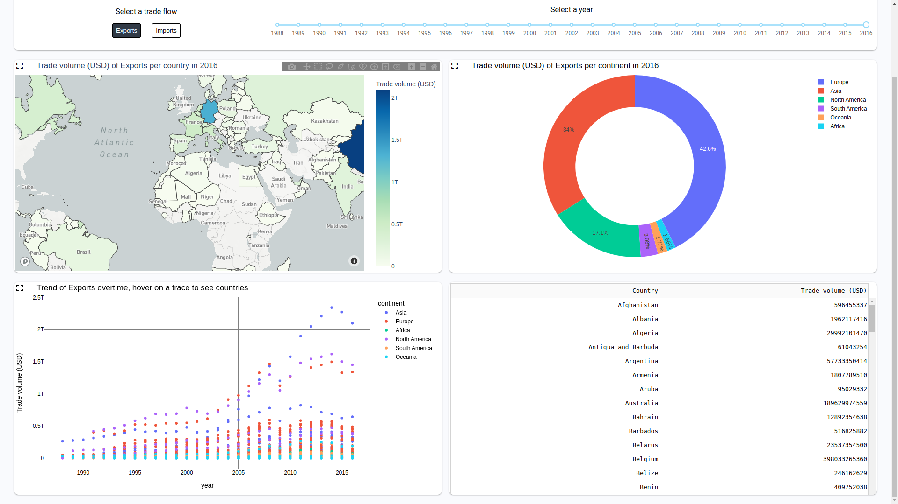

# Commodities trading dashboard
taking a look at the trades of the world since 1988


## How to run this app locally

To run this app locally, clone this repository and open this app folder in your terminal/Command Prompt. We suggest you to create a virtual environment for installation of required packages for this app.

```
cd commodities_trading
python3 -m virtualenv venv

```
In Unix System:
```
source venv/bin/activate

```

In Windows: 

```
venv\Scripts\activate
```

Install all required packages by running:
```
pip install -r requirements.txt
```

Run this app locally by:
```
python app.py
```


## Screenshot




This app was created by [Fayez Hesham](https://github.com/fayezhesham), Please ask for permission if you intend to use it.